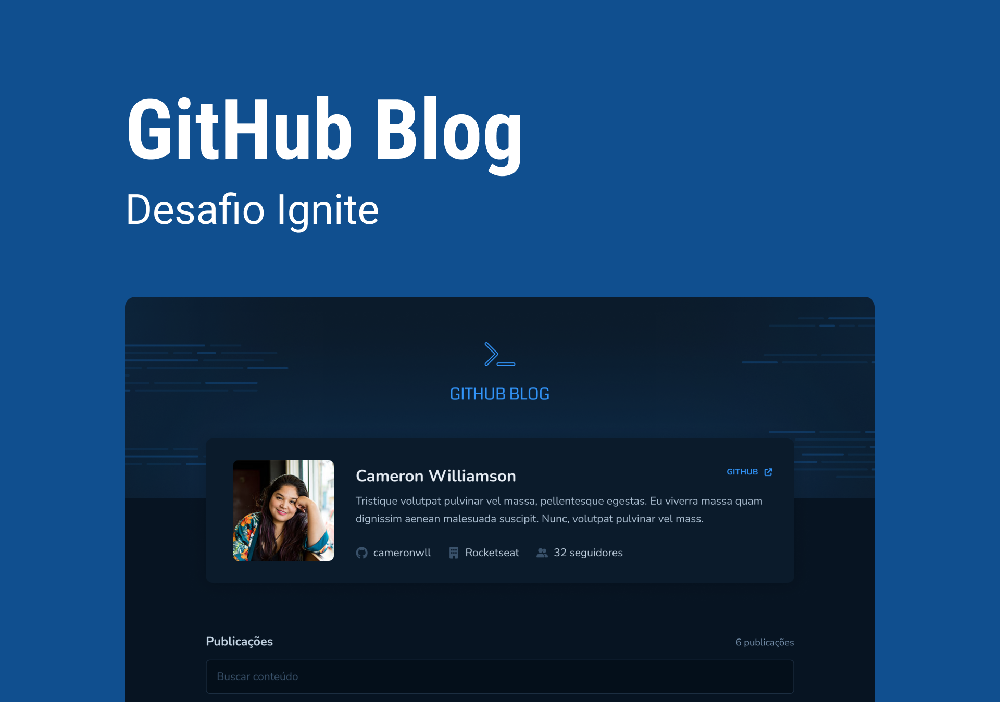

<h1 align="center">
    
</h1>

## Projeto

Nesse desafio, foi praticado a utilização de clientes HTTP consumindo a API do Github para criar um blog pessoal.

## Sobre

Nesse desafio, você vai desenvolver uma aplicação que utilizará da API do GitHub para buscar issues de um repositório, dados do seu perfil e exibir elas como um blog.

- Listagem do seu perfil com imagem, número de seguidores, nome e outras informações disponíveis pela API do GitHub.
- Listar e filtrar todas as issues do repositório com um pequeno resumo do conteúdo dela
- Criar uma página para exibir um post (issue) completo

Apesar de serem poucas funcionalidades, você vai precisar relembrar conceitos como:

- Fetch / Axios
- Roteamento e React Router DOM
- Formulários

Para completar esse desafio você vai precisar fazer alguns preparativos e principalmente de algumas pesquisas para entender sobre a API do GitHub.

## Techs

- React JS
- Typescript
- Stitches

## Uso

- Clone o repo `https://github.com/ronaldprofile/rseat-github-blog`
- Instale as dependências `yarn`
- Execute o server `yarn dev`
